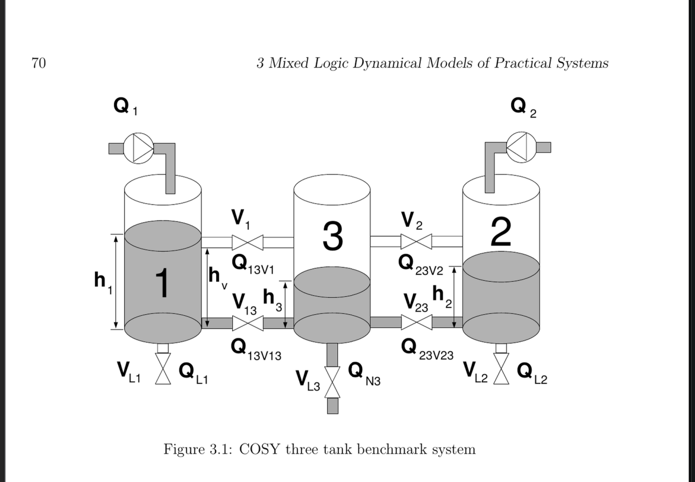

# Three-Tank System: Hybrid MLD-MPC Control


### 1. Installation

Open a terminal in the project root and instantiate the environment to download dependencies:

```bash
julia --project=. -e 'using Pkg; Pkg.instantiate()'
```

### 2. Run the Simulation

The primary entry point is the closed-loop MPC simulation script. This script initializes the plant, sets up the controller, runs the optimization loop, and visualizes the results.

```bash
julia --project=. scripts/02_closed_loop_mpc.jl
```

**Output:** A plot window will appear showing:
   * **Water Levels:** $h_1, h_2, h_3$ tracking the reference trajectories.
   * **Inputs:** The control actions taken (Pump Flows and Valve States).

## How to Configure Inputs

1. **Initialize Settings:** Create the settings object.
2. **Set Active Inputs:** Use `set_active!(settings, :Symbol...)` to tell the MPC which variables it is allowed to toggle/change.
3. **Set Nominal Values:** Use `set_nominal!(settings, :Symbol, value)` to fix the state of inputs *not* under MPC control.

#### Scenario A: Pumps Only (Classic Control)

In this scenario, the MPC optimizes pump flows, but all valves are fixed manually.

```julia
settings = InputSettings()

# 1. Let MPC control Pump 1 and Pump 2
set_active!(settings, :Q1, :Q2)

# 2. Fix physical constraints (e.g., Output Drain VL3 is always open)
set_nominal!(settings, :VL3, 1.0) 

# Note: All other valves (V1, V2, V13, V23, VL1, VL2) default to 0.0 (Closed) 
# unless specified in set_nominal!
```

#### Scenario B: Hybrid Control (Pumps + Valves)

Here, the MPC can control Pump 1 and the upper connection valve $V_1$ to satisfy the objective.

```julia
settings = InputSettings()

# The MPC will decide when to open V1 and how much to pump Q1
set_active!(settings, :Q1, :V1)

# Ensure the output drain is open
set_nominal!(settings, :VL3, 1.0)
```

## System Description & Inputs

The system models the "COSY Three Tank Benchmark". Below is the mapping between the visual labels, the code symbols used in `ThreeTankSystem.jl`, and their physical descriptions.



### Actuator Mapping Table

| Diagram Label | Code Symbol | Description | Control Type |
| :--- | :--- | :--- | :--- |
| $Q_1$ | `:Q1` | **Pump 1 Flow:** Inflow to Tank 1. | Continuous ($0 \dots Q_{max}$) |
| $Q_2$ | `:Q2` | **Pump 2 Flow:** Inflow to Tank 2. | Continuous ($0 \dots Q_{max}$) |
| $V_1$ | `:V1` | **Upper Valve 1:** Connects Tank 1 $\to$ Tank 3 at height $h_v$. | Binary (Open/Closed) |
| $V_2$ | `:V2` | **Upper Valve 2:** Connects Tank 2 $\to$ Tank 3 at height $h_v$. | Binary (Open/Closed) |
| $V_{13}$ | `:V13` | **Lower Valve 1-3:** Connects bottom of Tank 1 $\to$ Tank 3. | Binary (Open/Closed) |
| $V_{23}$ | `:V23` | **Lower Valve 2-3:** Connects bottom of Tank 2 $\to$ Tank 3. | Binary (Open/Closed) |
| $V_{L1}$ | `:VL1` | **Drain Valve 1:** Leak/Drain at bottom of Tank 1. | Binary (Open/Closed) |
| $V_{L2}$ | `:VL2` | **Drain Valve 2:** Leak/Drain at bottom of Tank 2. | Binary (Open/Closed) |
| $V_{L3}$ | `:VL3` | **Drain Valve 3:** Output drain at bottom of Tank 3. | Binary (Open/Closed) |
### Physical Parameters

* $h_1, h_2, h_3$: Water levels in the respective tanks (State Variables).
* $h_v$: The height of the upper connection pipes. Water only flows through $V_1$ or $V_2$ if the level in the source tank exceeds this height.

## 📂 Project Structure

```text
ThreeTankSystem/
├── scripts/
│   ├── 01_open_loop_physical.jl  # Test plant physics (no controller)
│   ├── 02_closed_loop_mpc.jl     # MAIN: Run the MPC simulation
│   └── 03_controller_test.jl     # Unit tests for controller logic
├── src/
│   ├── ThreeTankSystem.jl # Module entry point
│   ├── plant.jl           # Nonlinear ODE model (ModelingToolkit)
│   ├── MLDModel.jl        # JuMP Optimization Model (Logic -> MIP)
│   ├── controllers.jl     # MPC loop implementation
│   ├── simulation.jl      # Simulation orchestrator
│   └── types.jl           # Parameter structs & InputSettings
└── Project.toml           # Dependencies